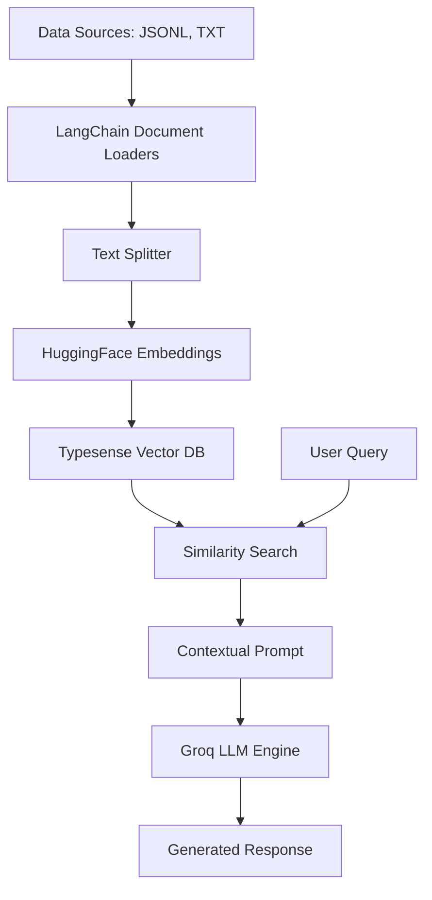

# 🚀 RAG System with Typesense & LangChain

A sophisticated Retrieval-Augmented Generation (RAG) system leveraging **Typesense** as a high-performance vector database, **LangChain** for orchestration, and **Groq** for lightning-fast inference.

---

## 🌟 Overview

This project implements a robust RAG pipeline designed for high-speed document retrieval and intelligent response generation. By combining Typesense's rapid search capabilities with the low-latency inference of Groq's LLMs, this system provides accurate answers grounded in provided datasets.

### ✨ Key Features
- **Scalable Vector Search**: Powered by Typesense for ultra-fast document retrieval.
- **Advanced LLM Integration**: Uses Groq (ChatGroq) for high-performance natural language generation.
- **Flexible Document Processing**: Supports loading from multiple formats (JSONL, TXT, etc.).
- **Modern Tech Stack**: Managed with `uv` for lightning-fast dependency resolution.

---

## 🛠️ Project Architecture



---

## 🚀 Getting Started

### 📋 Prerequisites
- Python 3.11+
- [uv](https://github.com/astral-sh/uv) (Package Manager)
- Typesense Cloud or Local Instance
- Groq API Key

### 📦 Installation

1. **Clone the repository:**
   ```bash
   git clone <repository-url>
   cd RAG
   ```

2. **Setup virtual environment and dependencies:**
   ```bash
   uv venv
   source .venv/bin/activate  # On Windows: .venv\Scripts\activate
   uv sync
   ```

3. **Configure Environment Variables:**
   Create a `.env` file in the root directory:
   ```env
   GROQ_API_KEY=your_groq_api_key
   TYPESENSE_API_KEY=your_typesense_key
   TYPESENSE_HOST=your_typesense_host
   ```

---

## 📝 Usage

The primary implementation resides in the Jupyter Notebook:

- **`typesense.ipynb`**: Contains the full pipeline—from data ingestion and indexing into Typesense to running the RAG chain with LangChain and Groq.

### Data Files
- `book.jsonl`: Large dataset for book-related queries.
- `test.txt`: Sample document (e.g., information about the Sun) for testing the RAG functionality.

---

## 🗂️ File Structure

| File/Folder | Description |
| :--- | :--- |
| `typesense.ipynb` | Core implementation notebook |
| `book.jsonl` | Dataset for book indexing |
| `test.txt` | Sample text data for RAG testing |
| `pyproject.toml` | Project configuration and dependencies |
| `uv.lock` | Locked dependencies for reproducibility |
| `data/` | Directory for additional raw data |
| `src/` | Componentized source code (if applicable) |

---

## 🧪 Tech Stack

- **Orchestration**: LangChain
- **Vector DB**: Typesense
- **LLM Provider**: Groq
- **Embeddings**: HuggingFace (`all-MiniLM-L6-v2`)
- **Package Manager**: UV

---

## 📄 License

[MIT License](LICENSE)
